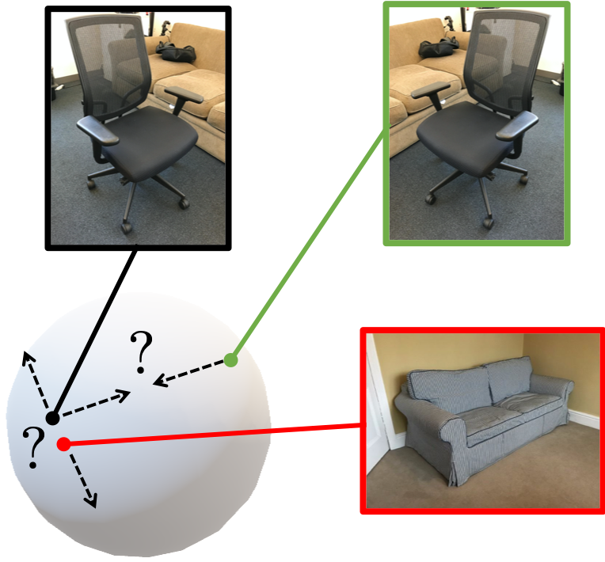
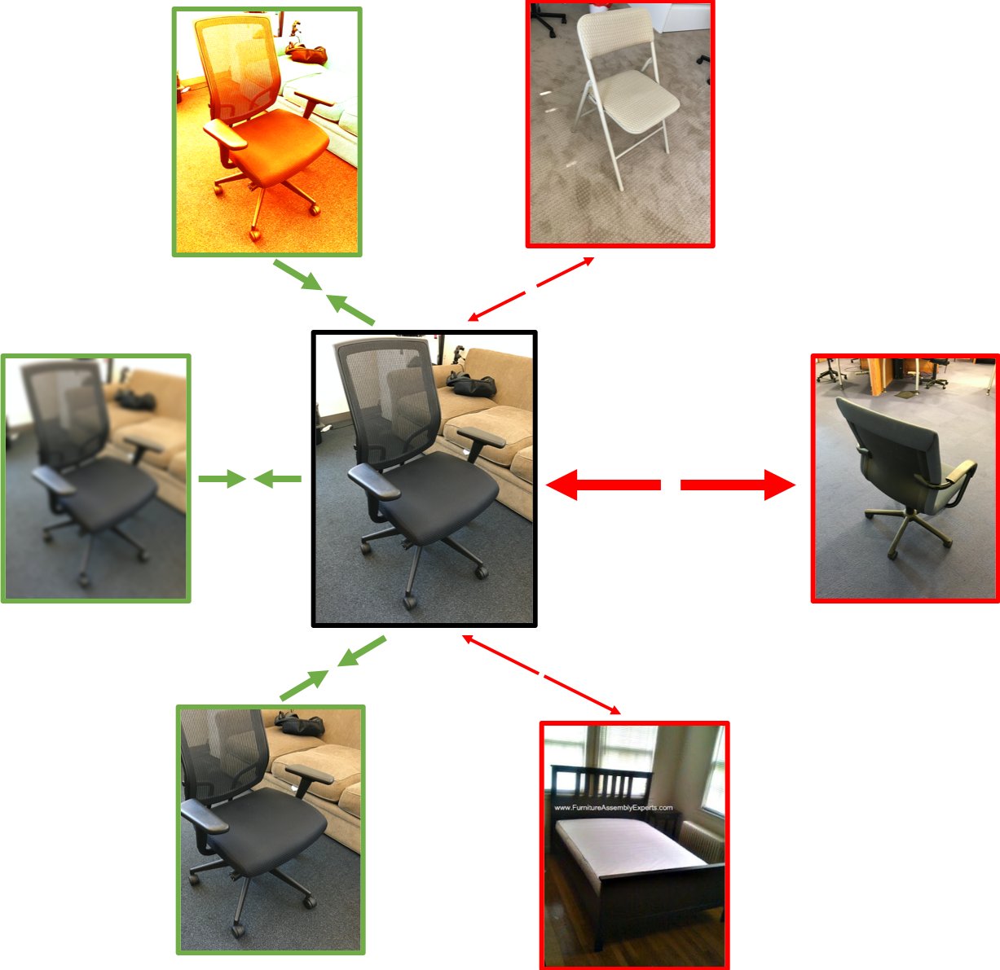
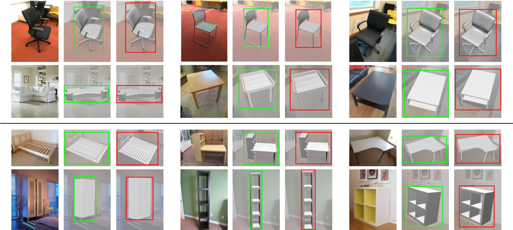

# PoseContrast

[3DV 2021 Oral] Pytorch implementation of [**Class-Agnostic Object Viewpoint Estimation in the Wild with Pose-Aware Contrastive Learning**](https://arxiv.org/abs/2105.05643) paper.

Check out our [**Paper**](https://arxiv.org/abs/2105.05643) and [**Webpage**](http://imagine.enpc.fr/~xiaoy/PoseContrast/) for more details.

<p align="center">
  
  &emsp; &emsp; &emsp;
   
</p>


```
@INPROCEEDINGS{Xiao2020PoseContrast,
    author    = {Yang Xiao and Yuming Du and Renaud Marlet},
    title     = {PoseContrast: Class-Agnostic Object Viewpoint Estimation in the Wild with Pose-Aware Contrastive Learning},
    booktitle = {International Conference on 3D Vision (3DV)},
    year      = {2021}
}
```


## Installation

### 1. Create conda environment
```
conda env create -f environment.yml
conda activate PoseContrast
```

**PyTorch version:** This repo has been tested under PyTorch 1.0.0 and PyTorch 1.6.0 with similar performances.

### 2. Download datasets
```
cd ./data
bash download_data.sh
```

This command will download following datasets:
- `Pascal3D+` 
  ([link](https://cvgl.stanford.edu/projects/pascal3d.html) to the original dataset page. 
  ImageNet and PascalVOC images picturing 12 rigid object classes in the wild)
- `Pix3D` 
  ([link](http://pix3d.csail.mit.edu) to the original dataset page. 
  Mixed-sources images picturing 9 rigid object classes including "tools" and "misc".)
- `ObjectNet3D`
  ([link](https://cvgl.stanford.edu/projects/objectnet3d/) to the original dataset page. 
  ImageNet images picturing 100 rigid object classes.)

**Note:** Pix3D is only used for evaluation, while Pascal3D+ and ObjectNet3D both contain _train/val_ split for training and testing.

### 3. Download pretrained models
```
cd ./pretrain_models
bash download_moco.sh
```
This command will download the [**MOCOv2**](https://github.com/facebookresearch/moco) model released by FAIR and correct the module names.

```
mkdir exps/PoseContrast_Pascal3D_MOCOv2 && cd exps/PoseContrast_Pascal3D_MOCOv2
wget https://www.dropbox.com/s/mlmubnz9xgbflm4/ckpt.pth?dl=0
```
This command will download our class-agnostic object viewpoint estimation network trained on Pascal3D+ dataset.


## How to use

### 1. Launch a training
```
./scripts/train.sh 
```
Models are saved at `exps/PoseContrast_Pascal3D_MOCOv2`, a training log file `trainer.log` will also be generated.

### 2. Evaluate on different datasets
```
./scripts/test.sh 
```
Evaluate the model on Pascal3D+ and Pix3D:
- `prediction` folder would be created to save the predicted viewpoints,
- `correlation` folder would be created to save the angle classification scores and viewpoint estimation errors,
- testing log file `tester.log` would be generated saving the quantitative evaluation results.


## Visual Results

<p align="center">
  
</p>


## Further information

If you like this project, please check out related works on object pose estimation from our group:
- [Xiao and Marlet - Few-Shot Object Detection and Viewpoint Estimation for Objects in the Wild (ECCV 2020)](https://arxiv.org/abs/2007.12107)
- [Xiao et al. - Pose from Shape: Deep Pose Estimation for Arbitrary 3D Objects (BMVC 2019)](https://arxiv.org/abs/1906.05105)
